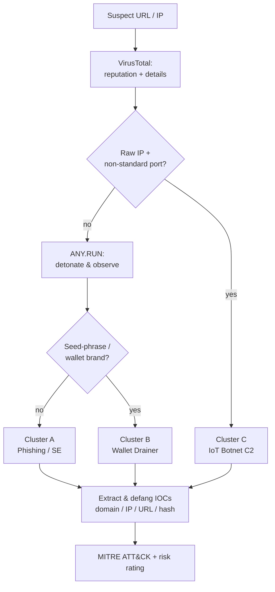

# 🔬 Analysis Workflow
Hub: [[00 - MOC Scenario 17]].

**Five phases** applied to every indicator:
1. **Initial analysis** — [[VirusTotal]] reputation, expand shorteners, record serving IP / status / hash.
2. **Deep analysis** — detonate in [[ANY.RUN]], watch DNS / HTTP / process / file activity.
3. **Technique ID** — obfuscation, typosquatting, cloud & TLS abuse, non-standard ports.
4. **Risk assessment** — phishing / malware / credential theft? user exposure?
5. **Reporting** — consolidate defanged IOCs, severity, recommendations.

## Per-URL triage (rendered in Obsidian)

Tools used: [[VirusTotal]] · [[VirusTotal Graph]] · [[ANY.RUN]].
